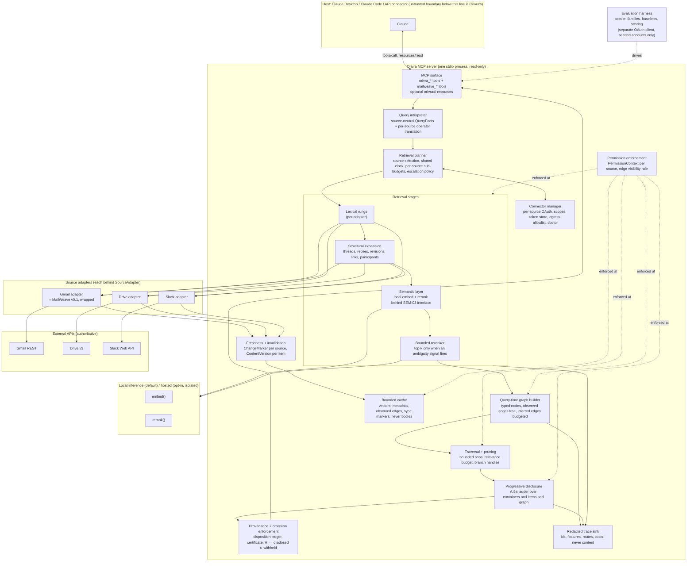
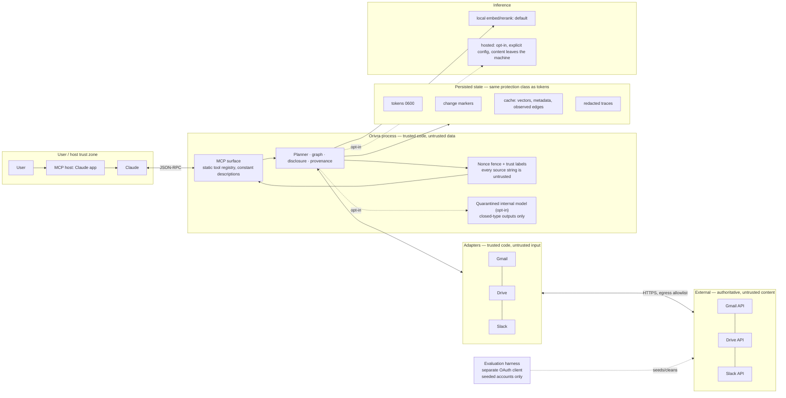

# Orivra v1 — architecture and plan (design checkpoint, for owner review)

**Status: DRAFT for owner review, 2026-09-10. No implementation code has been written against
this document.** MailWeave Gmail v0.1 is frozen at tag `v0.1` (`d15158d`) and is treated as
authoritative throughout; where this plan and a proposal in an older document disagree, the code
and the frozen behaviour win.

Orivra is the umbrella product. MailWeave remains its Gmail retrieval engine. The `mailweave`
packages, CLI, configuration paths and the four `mailweave_*` MCP tools keep their names and their
v0.1 behaviour.

This document is the ten deliverables of the design brief's §22, in order, preceded by the
research findings they rest on and followed by the corrections to the brief's own sequence that the
current code forces. Every design choice names what it derives from: a MailWeave contract, a
primary source, or a measurement still to be made.

---

## 0. What the research settled, and what it did not

Four primary-source investigations were run before any design was written. Full reports are in
`docs/reviews/ORIVRA_V1/RESEARCH_*.md`. What they settle:

**The graph must be built at query time and seeded from retrieval, not the other way round.**
Microsoft's LazyGraphRAG is not index-free: it still precomputes a lightweight graph by NLP
noun-phrase extraction and co-occurrence, plus a hierarchical community structure over it. What it
defers to query time is the **LLM work** — subquery expansion, sentence-level relevance assessment,
claim extraction and summarisation — and it bounds that work with a single relevance-test budget.
On its own AP-news corpus it reports index cost "identical to vector RAG and 0.1% of the costs of
full GraphRAG". Full GraphRAG's paper reports 281 minutes of indexing per ~1M tokens; its outputs
do carry fields used for incremental update merges, so the accurate limitation is narrower than
"no incremental-update story": **its update approach has not established the freshness and
permission behaviour Orivra requires** — nothing in the published material addresses per-item
version verification, access revocation, or invalidation of derived summaries and extracted
relations. Two independent benchmarks (BenchmarkQED, GraphRAG-Bench) show vector RAG with
reranking beating graph methods on directly answerable questions. Every number in that literature
is scoped to its dataset — AP news, podcast transcripts, novels, medical guidelines — with
synthetic queries and LLM judges; **none of it transfers to Orivra without measurement here.** So:
query-time graph, cheap deterministic edges from metadata, LLM extraction only behind an explicit
budget and only if it measures as worth it.

**GraphRAG's one durable contribution to our schema is the covariate.** Its claims carry
`Claim Status`, `text_unit_ids` and a mandatory list of verbatim source quotes. The family has no
formal observed-versus-inferred distinction and its `relationship_strength` is an uncalibrated LLM
number. Orivra's edge model takes the span-tied provenance and rejects the strength-as-confidence
idea.

**MCP resources are legal but not dependable as the primary surface, and the hosted connector is
a different deployment entirely.** The current specification is 2026-07-28 (stateless, no
`initialize`, `subscriptions/listen` replacing resource subscribe). Claude.ai and Claude Desktop
list resources as supported but do not document how they reach the model; resource subscriptions
are explicitly unsupported there; the Messages API connector supports tools only; Claude Code's
model can list and read resources through its own tools. The hosted Claude runtime still speaks a
handshake-based revision.

Two consequences the plan is built on. **Direct tools are mandatory**, resources are an additive
projection, and **no core workflow may depend on a client surfacing MCP resources**. And **the
hosted API connector cannot use a local stdio server at all** — it requires a publicly reachable
HTTP endpoint. v1's first distribution target is therefore explicit: **a local stdio server for
Claude Desktop and Claude Code.** Hosted, web and API support is a separate deployment
architecture (Streamable HTTP transport, server-side OAuth handling, tenant isolation,
operational security) and is out of v1's scope; §6.6 records what it would take.

**The three sources change in three different ways, and the invalidation layer has to respect
each.** Gmail message content is immutable; only labels change; `history.list` is best-effort with
a documented 404 that forces a full resync. Drive change tokens never expire; `removed: true`
means deleted or access lost and the record does not say which; `files.get` returns 404 in both
cases; `version` is the freshness key for all file types and `headRevisionId` exists only for
binaries. Slack `ts` is identity per channel; edits keep `ts` and add `edited`; deletions make the
message vanish from history; cursors expire and must not be persisted; free workspaces hide
messages past 90 days; and for unlisted commercially distributed apps installed after 2025-05-29,
`conversations.history` is rate-limited to one request per minute returning fifteen objects,
while internal apps keep Tier 3.

What the research did not settle, and what the plan therefore measures rather than assumes: whether
the graph step helps at all on local questions; the latency of sequential relevance tests; whether
contextual-retrieval gains measured on code and papers transfer to mail; the fabrication rate of
any query-time claim extraction; and whether `threads.get(format=metadata)` returns snippets, which
D.5 already marks as blocking (PF-2) and which has still not been run.

---

## 1. Current-state map

Derived by reading `server/src/mailweave` (85 modules, 33,488 lines), the harness (20 modules,
3,715 lines) and the governing documents. Status is what the code does today, not what a document
proposes.

| v1 responsibility | MailWeave v0.1 today | Status | v1 disposition |
|---|---|---|---|
| Orivra MCP surface | `surface/{tools,server,arguments,partition,rendering,service,runtime}`: four tools over stdio, D.11 error partition, text mirror as a projection of the envelope | IMPLEMENTED (Gmail-only) | **Generalise.** Orivra mounts its own tools beside the four `mailweave_*` tools on one server; the partition, rendering and error taxonomy are reused unchanged |
| Connector and authorisation manager | `auth/*`, `config.py`, `cli.py`: loopback+PKCE consent, granted-scope readback that fails closed, 0600 token store, two-host egress allowlist enforced in the transport | IMPLEMENTED (one connector) | **Generalise.** Becomes a registry of connectors, each with its own client, scopes, token store entry, egress hosts and `doctor` lines. Gmail is the first registrant with zero behaviour change |
| Query interpreter | `query/{analysis,operators,identifiers,timepolicy}`: table-driven, model-free parse into terms, constraints, identifiers, time window, answer type, relaxation order | IMPLEMENTED (Gmail operators) | **Generalise.** The parse becomes source-neutral `QueryFacts` plus a per-source operator translation; Gmail's translation is the existing code |
| Retrieval planner and escalation | `retrieval/ladder.py`, `policy/{account,budget,stopping}`: L0–L4 planned as a pure function of the parse; every rung accounted; `BudgetAccountant` refuses before the spend; `Governor` exists but is not wired into `search` | IMPLEMENTED | **Generalise.** One planner over N adapters with a shared clock and per-source sub-budgets; the accountant becomes hierarchical; the governor gets wired (pre-existing backlog R-GOV-001) |
| Lexical retrievers | L0 exact operator, L1 filtered, L1b decomposition, L2 relaxation, L3 broadening, L4 `rfc822msgid:` sibling lookup | IMPLEMENTED | **Keep as the Gmail adapter's ladder.** Drive and Slack get their own rung tables against their native search |
| Semantic retrieval | Budget caps, tool-schema args, `semantic_unavailable` error, `pool`/`shortlist` wire slots, `generative_llm_calls = 0` as a CI-swept invariant; no model, no embeddings | SLOT-ONLY | **New, per AD D.5** (models, pool rules and `embed`/`rerank` interface are already specified). Blocked on PF-2 |
| Reranker | `MAX_RERANK_PAIRS`, `Score`/`Shortlist` wire types, `"rerank": L6` mapping | SLOT-ONLY | **New, per AD D.7** (mechanical tier exists conceptually; cross-encoder tier absent) |
| Gmail source adapter | `gmail/{client,models,rates,retry,meter,faults}`, `retrieval/transport.py`, `content/*` (MIME → charset ladder → headers → HTML → NFKC → annotate → reductions) | IMPLEMENTED | **Wrap, do not rewrite.** The adapter interface is fitted over the existing client and content pipeline |
| Drive adapter | none | ABSENT | **New** (M4) |
| Slack adapter | none | ABSENT | **New** (M5) |
| Source-independent evidence model | `envelope/*`: `Envelope`, `Source`, `MessageRow`, `CollapsedRun`, `WithheldRecord/Group/Tail`, `OmissionSummary`, `NotIncludedBlock`, `Affordance`, `RetrievalReport`, closed `Reason` union, `DispositionLedger`/`Certificate`, sealed models | IMPLEMENTED (Gmail vocabulary) | **Generalise by derivation.** The v1 schemas in §4 are the existing ones with `source`, `container` and `version` made explicit; every validator survives |
| Identity and handles | `handles/{mint,redeem,keys,cache,digest}`: HMAC-SHA256 handles, key epochs, expiry, liveness walk, digest | IMPLEMENTED (thread maps) | **Generalise.** The same minting covers conversation maps, file revision sets, graph branches and omission regions |
| Entity resolution | participants keyed on address, never display name (`structure/participants.py`); reply tree from RFC headers | PARTIAL (Gmail-internal) | **New layer** with deterministic identity and candidate-only fuzzy aliasing (§4, §11 of the brief) |
| Query-time context graph | none. Thread maps and reply trees are per-thread structures, not a graph | ABSENT | **New** (M3), built over the existing reply tree and participant index as its first observed edges |
| Graph traversal and pruning | none | ABSENT | **New** (M3) |
| Progressive disclosure | `disclosure/{ladder,plan,layout,floor,weights,segments}` + `envelope/measure`: A.9a's eight steps as ordered data with per-step invariants; one cost function shared with the envelope; Baseline F selector | IMPLEMENTED | **Generalise the layout.** `Source` → container, `MessageRow` → item row; the eight steps and their invariants are unchanged; sizing constants are certified per renderer as round 29 did for Gmail |
| Provenance and omission enforcement | I-1/I-2 re-read from the serialised mapping against the certificate at the `model_dump` chokepoint; `partial` computed, never settable; `withheld := H − disclosed` | IMPLEMENTED | **Extend the certificate to graph nodes and edges.** Every retrieved node is disclosed or withheld with a handle; a pruned branch is an omission, not a silence |
| Freshness and invalidation | mailbox `historyId` watermark observed before first fetch; `fetched_at`/`verified_at` with an ordering validator; liveness walk on handle redemption; `handle_stale`/`handle_stale_unverifiable` | IMPLEMENTED (Gmail) | **Generalise.** A per-source `ChangeMarker` and `ContentVersion`; Drive and Slack mechanisms from §0 |
| Permission enforcement | exactly one scope, client-role split, non-configurable scopes and egress | PARTIAL by design | **New layer.** Gmail's model is one account; Drive's is per-file capabilities; Slack's is channel membership and token type. Edge visibility rule in §4 |
| Cache and index | `handles/cache.py`: one in-memory LRU of 64 thread maps, TTL 60 s, keyed `(thread_id, history_id_at_fetch)`, never consulted by the liveness probe. Nothing persistent | PARTIAL | **New bounded cache** (§5), keyed on the full dimension set |
| Redacted tracing | diagnostics ship in-band on the response (`RetrievalReport`, `Counters`); redaction rules exist but there is no log sink, no central redaction module | PARTIAL | **New trace sink** per AD D.10 schema v2, extended with a source dimension |
| Prompt-injection defence | per-response nonce fencing (violations refused, not escaped), static untrusted warning in the tool description, `hidden_content` reduction, Trojan-Source strip; WS-14's full posture built in M2 (INJ-01..INJ-06), untested against real mail | PARTIAL | Extend to derived artifacts (§7) |
| Recovery and retry | `surface/recovery.py`: bounded, monotonic, cycle-free, terminal | IMPLEMENTED | **Keep.** Graph and cross-source declines join the same schedule with new dimensions |
| Evaluation harness | preflight probes authored and unit-tested but not run live; three-arm deadline harness; **no seeder** (WS-16 unbuilt); no scoring module; no baseline runner | PARTIAL | **New.** The seeder is a prerequisite for every Tier-2 claim in this plan and is currently absent |

Two structural facts the refactor must respect: `retrieval/__init__.py` deliberately does not
re-export `ladder`/`assemble` to avoid an import cycle through `gmail.client`, so the adapter seam
must preserve that direction; and the test-to-source ratio is roughly 1.4:1 with 131 replants, so a
change that moves a module moves its replant anchors and the manifest test will say so.

---

## 2. System architecture



The one process is read-only end to end. Nothing in `ORIVRA` writes to any external API; the
evaluation harness is the only component that mutates a mailbox and it uses the seeder's separate
OAuth client against seeded accounts only, exactly as `SECURITY_NOTES.md` §0 requires today.

### 2.1 The adapter boundary

`SourceAdapter` is the seam. It is fitted over the existing Gmail code, not carved into it.

```
protocol SourceAdapter:
    connector: ConnectorId                      # "gmail" | "drive" | "slack"
    capabilities() -> AdapterCapabilities        # what this source can do: native search operators,
                                                #   container kind, revision support, change feed kind
    translate(facts: QueryFacts) -> NativeQuery  # per-source operator translation
    rungs() -> tuple[RungSpec, ...]              # this source's lexical ladder
    search(native: NativeQuery, budget) -> Hits  # ids only; every returned id enters H
    container(ref: SourceReference, budget) -> ContainerMap   # thread / conversation / revision set
    items(refs, depth, budget) -> tuple[Item, ...]
    changes_since(marker: ChangeMarker) -> ChangeSet | Resync
    permission_context(ref) -> PermissionContext
    version_of(ref) -> ContentVersion
```

For Gmail every method is a thin call into code that already exists: `translate` is
`query/operators.py`, `rungs` is `plan_ladder`, `search` is the ladder's `messages.list` path,
`container` is `_fetch_and_map`, `items` is the content pipeline, `changes_since` is
`history_additions` plus the 404 re-baseline, `version_of` is `(message id, historyId)`. The
`mailweave_*` tools do not go through the adapter at all; they keep calling `MailweaveService`
directly. Orivra's own tools reach Gmail only through the adapter. This is what makes M1's
demonstration meaningful: the same v0.1 workflows run once through each path and compared at the
two levels M1 defines — byte-identical under an injected clock, nonce and handle key over fixtures,
and semantically equivalent live once the volatile fields are normalised.

### 2.2 Where MailWeave's contracts land

| MailWeave contract | Orivra component that carries it |
|---|---|
| I-1 evidence preservation, `H ⊆ R` | `PROV`: `H` is the union of every adapter's observed ids plus every scored shortlist; the certificate seals disclosed ∪ withheld over it, and **graph nodes are in `R`** |
| I-2 explicit partiality | `DISC` + `PROV`: `partial` is computed from the payload; a pruned graph branch or a permission-hidden edge is an `OmissionRecord` with a handle, never a silence |
| I-3 adaptive cost | `PLAN`: the cheapest adequate route first; semantic and graph stages fire on recorded signals and their firing is in the trace |
| I-4 recoverability | `SURF` + `surface/recovery.py`: declines carry a bounded, monotonic retry; `not_found` only when every applicable path ran |
| A.7a disposition, A.9a ladder | `DISC` unchanged in step order and invariants; the layout gains container and item kinds |
| C-11 untrusted content, SN §6.3 | every source's text is fenced with the per-response nonce; derived artifacts inherit `trust: untrusted` and `derived_from[]` |
| D.11 error taxonomy | reused; new codes are added to the closed vocabulary, never minted ad hoc |
| A13 deadline | **legacy Gmail path only.** Orivra gets its own hierarchical budget, §2.3 |

### 2.3 Orivra's budget is its own, and it is measured, not inherited

`MAX_SERVER_MS = 7,700` was selected by owner decision for **one Gmail search on one connector**
(amendment A13). It does not cover three connectors, a cold local model load, semantic retrieval,
reranking, freshness verification, graph construction and disclosure. Assuming it does would repeat
exactly the mistake R-RETR-065 recorded: a deadline never measured against the work it has to
cover.

**The legacy path keeps 7,700 ms unchanged.** `mailweave_search` and its siblings are untouched.

**Orivra gets a hierarchical budget** with a stage for every phase that can consume wall time, each
one measured at the milestone that introduces it and each one declared in the response when it
binds:

| Stage | What it covers | First measured |
|---|---|---|
| `cold_start_ms` | local model load, first-call token refresh, adapter warm-up | M2 (models), M1 (refresh) |
| `retrieval_ms` per connector | that source's native search and structural expansion, under its own rate limits | M1 Gmail, M4 Drive, M5 Slack |
| `semantic_ms` | pool construction, stage-A embedding | M2 |
| `rerank_ms` | cross-encoder over the shortlist | M2 |
| `freshness_ms` | change-feed walks and version verification | M2 Gmail, M4/M5 per source |
| `graph_ms` | node and edge construction, expansion, pruning | M3 |
| `disclosure_ms` | the A.9a ladder, measurement and rendering | M1 |
| `recovery_ms` | a followed `orivra_expand` | M3 |

The planner runs **independent source searches concurrently** under one wall-clock budget where it
is safe to do so — each adapter's calls are independent HTTPS requests against different APIs with
independent rate limits, so the sequential sum is not the necessary cost. Concurrency is bounded
per source (never more in flight than that source's tier allows) and the accountant charges the
real elapsed time, not the sum of the parts. A source that exhausts its sub-budget becomes
`not_tried: {why: budget, affordance}` in `per_source`; it never fails the whole response.

Every figure in that table starts as `null` and is filled by measurement at its milestone. **No
Orivra deadline constant ships before the milestone that measures it**, and each one carries the
same provenance discipline A13 established: the date, the evidence, and whether it was validated or
selected.

---

## 3. Query execution sequence: the Atlas supplier question

"Why did we switch the Atlas packaging supplier from Larch to Willow?"

```mermaid
sequenceDiagram
    autonumber
    participant C as Claude
    participant S as orivra_ask
    participant Q as Query interpreter
    participant P as Planner
    participant G as Gmail adapter
    participant D as Drive adapter
    participant K as Slack adapter
    participant M as Semantic layer
    participant B as Graph builder
    participant L as Disclosure ladder
    participant V as Provenance seal

    C->>S: orivra_ask {question, sources: all enabled, budget}
    S->>Q: interpret
    Q-->>P: QueryFacts {terms: Atlas Larch Willow packaging supplier; answer_type: decision_rationale; no operators; no time window}
    P->>P: select sources: no source hint, all three enabled → all three; sub-budgets from one 7,700 ms clock

    par lexical rungs, in parallel, one clock
        P->>G: L1 filtered "Atlas Larch Willow"
        G-->>P: Hits {thread T1: 4 msgs} (ids enter H)
        P->>D: fullText contains 'Atlas' and 'certification'
        D-->>P: Hits {file F1 "Atlas packaging requirements", version 7}
        P->>K: search.messages "Atlas Larch"
        K-->>P: Hits {#packaging msg ts=…: "Larch failed cert"}
    end

    P->>P: sufficiency after lexical: evidence present in 3 sources, term_coverage 1.0 → semantic NOT escalated (recorded)
    P->>G: structural: thread map T1, reply tree, participants
    P->>D: structural: F1 revisions (v6, v7), links from F1
    P->>K: structural: thread replies for the Slack message

    P->>B: seed nodes = {4 Gmail msgs, F1@v7, F1@v6, 1 Slack msg + 2 replies, 3 people by address}
    B->>B: observed edges from metadata: reply_to ×3, thread_member ×4, file_revision_of, authored_by ×6, in_channel, slack_reply ×2, links_to (email → F1 URL found in body)
    B->>B: inferred edges, deterministic rules only: potentially_supersedes(msg3 → msg0) from explicit "withdraw the earlier approval" span; appears_related_to(Slack msg ↔ msg2) from shared identifier "Larch" + time adjacency, basis stated
    B->>B: bounded expansion: 1 hop from seeds, budget 20 nodes; prune by query score; pruned branch → ExpansionHandle
    B-->>L: QueryGraph {12 nodes, 18 edges, 2 pruned branches with handles}

    L->>L: A.9a over containers (T1, F1, Slack thread) + graph: bodies for msg0, msg3, F1@v7 excerpt, Slack msg; stubs for the rest; ceiling 9,000 tok / 25,000 chars
    L->>V: layout
    V->>V: certify: H == disclosed ∪ withheld over messages, files, slack msgs AND graph nodes; every inferred edge carries spans + method@version
    V-->>S: Envelope {sources[3], graph, omission, affordances, trace_id}
    S-->>C: structuredContent + text mirror + resource_link orivra://queries/{id}/graph

    Note over C: Claude reads: msg0 conditional approval → F1@v7 requirement → Slack failure report → msg3 withdrawal → Willow. Two edges marked inferred with their quoted spans; one branch pruned with a handle.
    C->>S: orivra_expand {handle: pruned-branch-1}  (only if needed)
```

What the sequence shows that a diagram cannot: the semantic layer did not run, and the response
says so in `retrieval_report.not_tried` with `why: not_applicable` and the coverage figure that
made it so. The two inferred edges are the only places Orivra said anything the sources did not,
and each names the span it read. The `links_to` edge is observed, because a URL to F1 was in the
message body; had the email merely mentioned "the requirements doc", the edge would have been
`appears_related_to` with a title-match basis, and marked inferred.

---

## 4. Source-independent schemas

Every schema here is derived from a MailWeave contract that already ships, with the source
dimension made explicit. Names are proposals; the field sets are the requirement. Types are
written in the style of `envelope/wire.py` (pydantic, frozen, closed enums, validators that
refuse rather than warn).

### 4.1 SourceReference — where a thing lives and how to get back to it

Generalises the pair `(thread_id, message_id)` plus `map_id` that every v0.1 row and affordance
carries.

```
SourceReference:
    connector: ConnectorId                 # gmail | drive | slack
    account: AccountRef                    # hashed account/workspace id, never the address itself in traces
    kind: RefKind                          # message | thread | file | file_revision | channel | conversation | slack_message | person
    native_id: str                         # Gmail message/thread id; Drive fileId (+revisionId); Slack (channel, ts)
    handle: Handle | None                  # HMAC handle (handles/mint.py) when a re-derivation is needed to reach it
    version: ContentVersion                # §4.3
    permission: PermissionContext          # §4.2, as observed at retrieval time
    locator: str | None                    # a URL the user can open (Gmail/Drive/Slack permalink), never used for retrieval
```

Rule inherited from A9: provenance on every row, scope preserved, never widened. A reference
minted under one account and permission context is never presented under another.

### 4.2 PermissionContext — what the caller could see when this was read

Gmail has one shape today (one account, one scope). Drive and Slack need more, and the field set
is the union.

```
PermissionContext:
    connector: ConnectorId
    principal: PrincipalRef                # the authorised user/account (hashed)
    scope_set: tuple[str, ...]             # granted OAuth scopes, read back after consent (auth/consent.py already does this)
    capability: Capability                 # gmail: read | drive: files.get capabilities booleans | slack: token kind + channel membership
    observed_at: Instant
    hash: str                              # stable digest of the above; the cache key dimension
```

Edge visibility rule (brief §15), in its full form: an edge is emitted only when **both endpoints
and every supporting source reference** are visible under the current `PermissionContext`. An edge
whose assertion rests on a third document the caller cannot read is not emittable even if both its
endpoints are readable, because the edge would disclose what that document says. Cross-source
traversal uses the intersection of the relevant contexts.

When any of those is hidden, the edge is not emitted and an `OmissionRecord` with
`cause: permission` is filed. **Internal accounting may retain the hidden identities** — the
disposition ledger needs them to keep `H` complete and the certificate honest — but the response
must not reveal a hidden id, title, timestamp, participant, relationship, or a count whose very
existence is unauthorised. Where even the count would disclose something (the number of documents
contradicting a visible email, in a workspace where the caller cannot see that such documents
exist), the record degrades to a presence-free form: connector and cause only. That is the rule
that stops "a confidential document contradicts this email" from leaking through the edge, and it
is stricter than the endpoint-only rule the first draft stated.

### 4.3 ContentVersion and ChangeMarker — freshness, per source

```
ContentVersion:                            # identity of one item's content at one moment
    gmail:  (message_id, history_id)       # content immutable; history_id moves only on label change
    drive:  (file_id, version, modified_time, head_revision_id | None)   # version is monotonic for all types
    slack:  (channel, ts, edited_ts | None, deleted: bool)

ChangeMarker:                              # where a source's change feed was last read
    gmail:  history_id                     # 404 → Resync (full), declared in the response
    drive:  start_page_token               # never expires; per driveId for shared drives
    slack:  (channel, oldest_ts, latest_ts) # cursors are NOT persisted; they expire

FreshnessStatus:
    verified_at: Instant                   # when the source last confirmed this version
    state: fresh | stale | unverifiable | gone | access_lost
    marker: ChangeMarker                   # what the verification walked from
```

Rules taken directly from the primary documentation: Gmail `messagesDeleted` is permanent and
`labelsAdded: TRASH` is not; Drive `removed: true` maps to `gone` **or** `access_lost` and the
two are not distinguished because both mean "must not serve"; Slack deletion is detected by absence
on re-read of the same window and edits by `edited.ts` differing from the cached value; a Slack
`channel_history_changed` or lost membership invalidates the whole channel. A failed verification
never serves the cached item: it degrades to a fresh source read, a resync, or an `inconclusive`
outcome, in that order.

### 4.4 EvidenceNode — a row that knows its source, version and trust

Generalises `MessageRow` and `Source`. The invariant that a thread is a `Source` with a
`stated_total` becomes: a container is a node whose children are known to a stated count.

```
EvidenceNode:
    node_id: NodeId                        # stable within the query graph; derived from SourceReference
    ref: SourceReference
    kind: NodeKind                         # message | thread | file | file_revision | slack_message | conversation | person | claim
    role: matched | context | floor | derived        # existing Reason/role vocabulary, plus derived
    reason: Reason                         # existing closed union (retrieval/envelope/reasons.py)
    depth: Depth                           # existing: stub | snippet | body_clean | body_full (+ excerpt for files)
    content: FencedText | None             # inside the per-response nonce fence; None at stub
    stated_total: int | None               # containers only; equals the source's count or the row is refused
    included: int | None                   # containers only; A4's rule, stubs count
    trust: untrusted                       # every source-derived node; derived nodes inherit it
    origin: source_backed | derived        # derived nodes carry derived_from[] and method@version
    freshness: FreshnessStatus
    timestamps: Timestamps                 # authored/sent/modified/edited as the source reports them (R-DEMO-002 closes here)
```

A `claim` node exists only when a query family calls for extraction, is always `derived`, always
carries the verbatim spans it was extracted from, and is refused by the validator if any span fails
to string-match its source content. That is GraphRAG's covariate rule made mandatory.

### 4.5 EvidenceEdge — observed and inferred can never look alike

```
EvidenceEdge:
    edge_id: EdgeId
    source: NodeId
    target: NodeId
    relation: Relation                     # closed enum, split into namespaces below
    origin: observed | inferred            # NOT a free field; each Relation belongs to exactly one namespace
    assertion: metadata | source_stated | derived   # observed splits: a fact of the source's data
                                           #   structures, vs a claim a human made in content
    asserted_by: NodeId | None             # source_stated only: who said it
    support: tuple[SourceReference, ...]   # what was read to assert this; ≥1 always
    spans: tuple[Span, ...]                # inferred edges: verbatim quotes with offsets; observed: empty allowed
    confidence: Confidence | None          # inferred only; {method, value, basis}; never on observed
    method: str                            # "metadata/reply_to@1" | "rule/explicit_supersede@1" | "embed/potion-32M@rev" | "llm/claims@rev" (opt-in)
    permission: PermissionContext          # the context under which BOTH endpoints were visible
    freshness: FreshnessStatus
    recomputable: bool                     # inferred: always true; observed: false (it is a fact of the source)

Observed / metadata (obs.meta):            reply_to, thread_member, file_revision_of, slack_reply,
                                           in_channel, attachment_of, authored_by, sent_to
Observed / source-stated (obs.said):       supersedes_stated, mentions, links_to
Inferred (inf.):                           appears_related_to, supports, contradicts, possibly_explains,
                                           potentially_supersedes, same_topic_as
```

**A span that matches the source proves the text exists. It does not prove the relationship is
correct.** That distinction is why the observed namespace is split in two, and why the first
draft's treatment of `supersedes_stated` was too weak.

**Metadata relations** — `reply_to`, `thread_member`, `file_revision_of`, `slack_reply`,
`in_channel`, `attachment_of`, `authored_by`, `sent_to` — are facts of the source's own data
structures. They are read from headers, thread membership, revision chains and channel membership.
Nothing is interpreted. These are the only relations Orivra asserts on its own authority.

**Source-stated assertions** — `supersedes_stated`, `mentions`, `links_to` — are claims a human
made inside content Orivra is reading. They are labelled `origin: observed` because the source
states them, but they carry `assertion: source_stated`, and the response says so: Orivra reports
that the source asserts this, never that Orivra verified it. Emitting one requires all of:

1. the exact span, preserved verbatim with its offsets, string-matched against the source content;
2. **target identification** — the span must identify both the relationship *and* which node it
   points at. "This supersedes the earlier version" with three candidate earlier versions in scope
   does not qualify; it becomes `inf.potentially_supersedes` with the ambiguity recorded, or no
   edge at all;
3. **negation, quotation, hypothetical and conditional handling** — "we are not withdrawing the
   approval", a quoted block reproducing someone else's withdrawal, "if certification fails we
   would withdraw", and "should we withdraw?" must each fail the rule rather than produce an edge.
   The recogniser runs over de-quoted, de-signature content (`content/quotes.py` already separates
   quoted regions) and refuses on a negation or modal cue inside the span's clause;
4. the asserting node recorded as the edge's `asserted_by`, so a reader can see who said it.

There is no `caused` relation in either namespace, and no rule promotes an inferred relation to an
observed one. The validator refuses: an inferred relation with no spans; an observed relation
carrying a confidence; a `source_stated` assertion with no `asserted_by` or an unresolved target;
and any edge whose endpoints or supporting references were not all visible under `permission`.

**Adversarial fixtures for exactly these cases** are part of family F20 and are listed in §8.3:
negated withdrawal, quoted withdrawal, hypothetical withdrawal, interrogative withdrawal,
ambiguous-target supersession, and a span that matches verbatim while pointing at the wrong
document. Each must produce no edge, or an inferred edge with the ambiguity stated. A replant
removes the negation check and the fixture must catch it.

### 4.6 EntityCandidate — identity is deterministic; likeness is a candidate

```
Entity:                                     # confirmed identity
    entity_id: EntityId                     # derived from a deterministic source key
    keys: tuple[DeterministicKey, ...]      # gmail address | slack (workspace, user_id) | drive permission emailAddress
    display_names: tuple[str, ...]          # untrusted, never a key

EntityCandidate:                            # a likeness, never a merge
    left: EntityId
    right: EntityId
    basis: display_name_match | domain_match | co_occurrence | explicit_link
    evidence: tuple[SourceReference, ...]
    confidence: Confidence
    status: candidate | confirmed_by_source | rejected
```

Two entities merge only when a deterministic key is shared (the same address appears as a Slack
user's profile email and as a Gmail sender) or a source states the link explicitly. A candidate
never affects retrieval, ranking or edge construction; it is disclosed as a candidate so the agent
can see that "Alex in Slack" and "alex@company.com" might be one person without Orivra having
decided it. This is the rule from `structure/participants.py` (address, never display name) made
cross-source.

### 4.7 OmissionRecord and ExpansionHandle — every omission has a cause and a way back

Generalises `WithheldRecord`, `WithheldGroup`, `WithheldTail`, `NotIncludedBlock` and `Affordance`.

```
OmissionRecord:
    what: NodeId | ContainerRef | BranchRef | RegionRef      # granularity = the call that recovers it (round 29's rule)
    count: int                              # exact; groups and tails keep their counts
    cause: Cause                            # cap(name) | ceiling | permission | freshness_unverifiable | source_gone | pruned(score) | not_tried(rung)
    why: str                                # the shared sentence, stated once per cause (omission.bound's rule)
    recover: ExpansionHandle | None         # None only for permission and source_gone, with count still stated
    connector: ConnectorId

ExpansionHandle:
    handle: Handle                          # HMAC-signed, key-epoch'd, expiring (handles/mint.py)
    tool: ToolName                          # orivra_expand | mailweave_thread_map | mailweave_get_messages | ...
    args: JsonObject                        # executable as-is; the tool it names must accept it (R-07)
    reduces: Dimension                      # what following it narrows or widens, for the retry contract
```

The certificate's sum now runs over messages, files, Slack messages **and graph nodes**: every node
the graph builder created is either in the disclosed graph or in an `OmissionRecord`. A pruned
branch is `cause: pruned(score)` with a handle; a hop the budget stopped is `cause: cap(max_hops)`.

### 4.8 QueryGraph, RetrievalTrace, CacheEntry

```
QueryGraph:
    query_id: QueryId                       # opaque, server-minted, passed back by the client (MCP statelessness rule)
    nodes: tuple[EvidenceNode, ...]
    edges: tuple[EvidenceEdge, ...]
    seeds: tuple[NodeId, ...]               # what retrieval put in before expansion
    hops_taken: int
    omitted: tuple[OmissionRecord, ...]     # pruned branches, capped hops, hidden endpoints
    built_at: Instant
    ttl: Duration                           # ephemeral; see §5

RetrievalTrace:                             # AD D.10 schema v2 plus a source dimension
    ... every D.10 field ...
    per_source: {connector: {rungs_executed, hits, api_calls_by_method, quota_units, latency_ms, caps_hit, change_marker_used}}
    graph: {seed_count, node_count, edge_count_by_origin, hops, pruned_count, inferred_methods_used}
    entities: {confirmed, candidates}
    redaction_policy: str                   # which policy produced this trace

CacheEntry:
    key: CacheKey                           # §5.2: every dimension that changes the meaning
    kind: vector | metadata | structure | observed_edges | candidates | negative
    value: bytes                            # never a message body, never a document body
    version: ContentVersion
    permission_hash: str
    written_at: Instant
    expires_at: Instant                     # negative entries: short
    recomputable: bool                      # always true; a cache miss is correct and slower
```

---

## 5. Storage and caching decision

### 5.1 Three categories, stated exactly

| Category | What | Where | Lifetime | Invalidated by |
|---|---|---|---|---|
| **Ephemeral** | query graphs, layouts, candidate unions, shortlists, per-query relevance scores, the in-flight envelope | process memory only | one query; `QueryGraph` kept for `ttl` (default 10 min) so `orivra_expand` and `orivra://queries/{id}/…` can address it, then discarded | ttl; process exit; any freshness failure on a member node |
| **Cached** | embedding vectors; normalised metadata (ids, timestamps, participants, labels, titles, mime types); source-native structure (thread membership, reply tree, revision chain, Slack thread shape); **observed** edges; entity candidates; bounded negative results | `~/.local/share/orivra/cache/` (0700 dir, 0600 files, SQLite) | bounded by size and by entry TTL; whole cache is deletable by `orivra purge` | change feed (per source rules in §4.3); permission hash change; model or schema version change; TTL |
| **Persistent** | OAuth tokens (existing store, unchanged); handle keys (existing); per-source `ChangeMarker`s (Gmail `historyId`, Drive `startPageToken`, Slack per-channel `oldest/latest`); connector configuration; the redacted trace log | existing `~/.local/state/mailweave/` for Gmail (unchanged); `~/.local/state/orivra/` for the rest | until `purge` | markers re-baselined on documented failures (Gmail 404; Slack `channel_history_changed`) |

**Not persisted, in any category: message bodies, document bodies, Slack message text, attachment
content, derived summaries, inferred graph fragments.** `SECURITY_NOTES.md` §4.2 allows an index
containing body text only with an encryption story; v1 avoids the question by not persisting text.
Source text and extracted spans still live **in memory during a query** — retrieval, extraction,
disclosure and answering all need them — and are discarded with the `QueryGraph`.

**Everything in the cached category is sensitive derived workspace data.** The first draft said
embedding vectors were safe to persist because text cannot be reconstructed from them. That is
wrong: embedding inversion is a documented attack, and vectors of a private mailbox are private
data. Titles, participants, normalised metadata, thread and revision structure, entity candidates
and observed edges are all obviously sensitive on their face. So a single policy covers the whole
cache, at the same protection class as the token store:

* `0700` directory, `0600` files, under `~/.local/share/orivra/`, alongside the existing token
  store's discipline (`auth/tokenstore.py` sets these at `os.open` time, not afterwards);
* **account and permission isolation is structural**, not conventional: `principal` and
  `permission_hash` are key dimensions, so no query can read an entry written under another
  identity or another access state;
* **retention limits** per kind, not just per entry: vectors and structure expire on a bounded TTL
  even if nothing changed upstream, so an abandoned workspace decays instead of persisting
  indefinitely;
* `orivra purge` deletes the whole cache, and `mailweave purge` continues to delete what it always
  deleted;
* the cache is documented in the setup material as derived data on disk, because a user who thinks
  nothing is stored should not be wrong.

### 5.3 A permission hash is not proof of current access

`permission_hash` in the key proves an entry was written under a given access state. It does not
prove that state still holds — access can be revoked without anything in Orivra noticing. So the
key alone never authorises a serve. **Before a cached entry is served, its access must be
revalidated by one of three routes, and which one is a property of the entry's kind and age:**

| Route | When it applies | What it costs |
|---|---|---|
| **Change feed** | the connector has a durable feed the query already walked: Gmail `history.list`, Drive `changes.list` from the persisted token | one cheap call per source per query (Gmail 2 units), already required for freshness |
| **Direct permission check** | Drive items older than the feed's confidence window, or any item whose feed walk failed; `files.get?fields=capabilities` | one call per item, only on the items actually being served |
| **Bounded TTL** | Slack, where there is no permission feed: channel membership is re-observed per query, and per-message entries carry a short TTL after which they are re-read rather than served | a re-read of the window |

A revalidation that cannot be completed does not fall back to the cached value. It degrades, in
this order: fresh source read; resynchronisation; explicit `inconclusive` with the reason declared.
That is the same rule as §4.3's freshness degradation, applied to the access dimension rather than
the content dimension, and it is what makes the cache safe to keep at all.

### 5.4 The cache key

This is a deliberate narrowing of the brief's §13 list: "parsed MIME content", "graph fragments"
and "derived summaries where justified" are **not** cached in v1. Parsed MIME is text; graph
fragments contain inferred edges that must be recomputable and cheap enough not to need caching if
the observed edges and vectors are cached; summaries are derived text. Each can be reconsidered
after M3's measurements if the numbers say the recompute is the bottleneck.

Every entry's key is the tuple of every dimension that can change its meaning, hashed, and the
tuple is stored beside the hash so an audit can read it:

```
CacheKey = (principal, connector, native_id, content_version, permission_hash,
            model_id@revision | None, extraction_schema_version, redaction_policy, kind)
```

No dimension is optional. Two users of one machine never share an entry because `principal`
differs; a model upgrade never reads old vectors because `model_id@revision` differs. Note what the
key does **not** do on its own: a user who lost access to a file may still have a matching
`permission_hash` if Orivra has not yet observed the change, which is precisely why §5.3's
revalidation runs before any serve. Negative entries ("this search returned nothing") carry a TTL of minutes, not hours,
because the brief's rule is that absence is the most expensive thing to be wrong about.

### 5.5 Optimisations, and the rule for adopting them

The brief lists thirteen candidate optimisations. The plan adopts three at M1/M2 because they are
free of correctness risk and measured against v0.1 already: **lazy body retrieval** (v0.1 does
this: stubs and snippets first), **batch and coalesced API calls** where the source API supports
them (Gmail batch endpoint; Slack `conversations.replies` with `limit`), and **token-aware context
packing** (A.9a is exactly this). Two are adopted at M2 behind the semantic interface: **embedding
caches** and **hybrid lexical+vector retrieval** as D.5 specifies. The rest are **measured in M3
before adoption**: metadata indexes, incremental synchronisation, hierarchical summaries,
graph-fragment caching, bounded parallelism. Rerank-only-top-N is not an optimisation to adopt; it
is the only affordable shape (D.5, cross-encoder cost linear in candidates) and is built that way.

The adoption rule, verbatim from the brief and enforced in M7's release report: an optimisation
stays only if latency, recall, context size or API cost moved measurably on the pre-registered
families. Analogy to another system is not a reason.

---

## 6. MCP interface proposal

### 6.1 Direct tools, mandatory

All tools carry `readOnlyHint: true`, `destructiveHint: false`, `idempotentHint: true`,
`openWorldHint: false`, a `title`, a name of ≤ 64 characters, an `outputSchema`, `structuredContent`
plus the serialised text block the spec asks for, and `ttlMs`/`cacheScope` on results. Anthropic's
review criteria say read-only tools run without per-call confirmation; that is the difference
between a usable evidence loop and one that prompts on every expansion.

| Tool | Purpose | Arguments (sketch) | Returns |
|---|---|---|---|
| `orivra_ask` | the question, across enabled sources | `question`, `sources?: [gmail\|drive\|slack]`, `budget?`, `view?`, `graph?: bool` (default true) | an `Envelope` v2: containers per source, items, `graph` (nodes, edges, omissions), `omission`, `affordances[]`, `retrieval_report` with `per_source`, `query_id`, one `resource_link` to `orivra://queries/{query_id}/graph` |
| `orivra_expand` | follow one handle: a node, container, graph branch, omitted region, or a candidate entity | `query_id`, `handle`, `depth?` | the expanded region as a partial `Envelope` merged under the same `query_id` |
| `orivra_sources` | connector status | none, or `connector` | per-connector: enabled, authorised, scopes granted, last change marker, freshness state, rate-limit tier observed, what is unavailable and why |
| `orivra_trace` | the redacted trace for one query | `query_id` | the `RetrievalTrace`; ids and features, never content |

`mailweave_search`, `mailweave_thread_map`, `mailweave_get_messages` and `mailweave_get_attachment`
are mounted unchanged on the same server. `orivra_expand` on a Gmail thread handle **delegates to
the same code path** as `mailweave_thread_map` and returns the same container, so a v0.1 affordance
and an Orivra handle for the same thread are interchangeable and the v0.1 replants keep catching what
they catch.

### 6.2 Resources, additive

```
orivra://queries/{query_id}/answer-context     the disclosed envelope, as the tool returned it
orivra://queries/{query_id}/graph              nodes + edges + omissions, JSON
orivra://queries/{query_id}/omissions          every OmissionRecord with its handle
orivra://queries/{query_id}/trace              the redacted trace
orivra://queries/{query_id}/sources/{connector}/{container}    one container at its disclosed depth
```

Exposed through `resources/templates/list` (RFC 6570) and `resources/read`; each `orivra_ask`
result carries a `resource_link` to its graph, which the spec says need not appear in
`resources/list`. **Every URI is also readable through `orivra_expand`**, so a client that ignores
resources loses nothing. No feature depends on `subscriptions/listen`; "changed since" is a tool
argument. The URI path is meaningful; the `query_id` inside it is opaque and server-minted, which is
the statelessness rule and the handle-opacity guidance both satisfied.

### 6.3 Virtual evidence workspace: not in v1

**Resources are additive throughout, and no core workflow depends on a client surfacing them.**
Every `orivra://` URI is readable through `orivra_expand`; a client that ignores resources entirely
loses no capability.


Spec-compatible in principle (`file://` resources "do not need to map to an actual physical
filesystem"), but directory traversal exists today only as a Claude Code tool
(`resources/directory/read`, absent from the 2026-07-28 and draft specifications), Claude.ai's
surfacing of resources is undocumented, and the API connector ignores resources entirely. Building
a workspace that degrades to §6.2 on one client and to nothing on another is not worth its cost
before M6's measurements say the agent needs navigation the tools do not give it. Recorded as a
candidate for after v1 with the measurement that would justify it: an agent that repeatedly
re-runs broad `orivra_ask` calls to re-find evidence it already saw.

### 6.4 Deployment target: local stdio for v1

**v1 ships one deployment: a local stdio MCP server**, launched by Claude Desktop or Claude Code
from the user's machine, exactly as MailWeave v0.1 does today. Every design decision above assumes
it: the token store is a local file, the cache is a local directory, the OAuth flow is a loopback
redirect, and the egress allowlist is enforced in-process.

**The hosted Claude API MCP connector cannot use this server.** It requires a publicly reachable
HTTP endpoint, and a local stdio process is not one. Supporting it is not a flag; it is a second
deployment architecture:

* Streamable HTTP transport instead of stdio;
* server-side OAuth: Orivra would broker each user's Google and Slack grants rather than each user
  holding their own, which changes the verification story entirely (§7.3);
* tenant isolation for tokens, caches and traces across users on shared infrastructure;
* operational security: key management, rotation, log handling, incident response.

That is a product decision with a cost, not an increment. It is **out of v1's scope**, recorded
here so the boundary is explicit rather than discovered later.

### 6.5 Configuration

One server entry in the client's config. Sources are enabled per connector in
`~/.config/orivra/config.json`; `orivra auth login --connector drive` runs that connector's
consent; `orivra doctor` prints one block per connector. A disabled or unauthorised connector is
reported by `orivra_sources` and appears in every `orivra_ask` response's `retrieval_report.per_source`
as `not_tried: {why: connector_disabled | not_authorised}` with the call that would enable it. The
Gmail connector's config, token store and `doctor` are the existing MailWeave ones, read by
reference; nothing about them moves.

### 6.6 Protocol posture

Target 2026-07-28 for Claude Code v2; keep the `initialize` handshake path for Claude.ai and
Desktop, which still speak ≤ 2025-11-25. The `mcp` Python SDK version in use handles both; the
negotiation is the SDK's, and the server declares `server/discover` as the spec requires.

---

## 7. Threat and failure analysis

### 7.1 Trust boundaries



The rule that holds every boundary: anything that crosses from `X` into `O` is data. It can appear
only inside fenced leaf fields; it cannot name a tool, alter a description, mint a handle, create an
edge marked observed, widen a permission, execute a recovery call, or appear in a connector-voiced
sentence. The internal model, if enabled, is inside the same rule: it emits closed types
(route labels, numeric scores, id lists, booleans, span offsets) that are validated before use, and
any free text it produces is treated as untrusted. That is `SECURITY_NOTES.md` §6.3 items 1–6,
extended to Drive and Slack and to derived artifacts.

### 7.2 Failure classes, each with its mechanism and its test

| Failure | How it would happen | Mechanism that prevents it | What proves the mechanism works |
|---|---|---|---|
| **False relationship** | an inferred edge asserts a link the sources do not support | inferred relations are a separate namespace; every one carries spans that must string-match the source; `confidence{method, basis}` is mandatory; the validator refuses an inferred edge with no spans | a replant that strips the span check makes a fixture with a planted false link pass; a family (F20 below) with deliberately near-miss threads must yield `appears_related_to` at most, never `supports` |
| **Incorrect entity merge** | display names collide ("Alex") and a merge contaminates every downstream answer | identity only from deterministic keys; likeness produces `EntityCandidate`, disclosed as such; candidates never feed retrieval, ranking or edges | F22 entity-collision family: two "Alex"es with different addresses; the answer must cite the right address and the candidate must be visible and unmerged |
| **Stale state served** | a cached vector, edge or structure outlives its source version | `ContentVersion` in every cache key; change feeds walked before serving; a failed verification degrades to a fresh read, resync, or `inconclusive`, never to the cached value | F23 stale-revision (Drive v6 answered after v7 exists) and F24 edited/deleted Slack message families; both must return the current state or an explicit `unverifiable` |
| **Permission leakage through an edge** | an edge reveals that a hidden node exists or what it says | edge emitted only when both endpoints are visible in the current `PermissionContext`; hidden endpoints produce an `OmissionRecord` with a count and connector and no identity | F25 permission-loss family: revoke a Drive file mid-corpus; the graph must lose the edge, the omission must count it, and no field anywhere in the response may contain the file's id, title or content |
| **Derived-content laundering** | a summary or claim is re-read as source, or a derived edge is presented as observed | `origin: derived` and `trust: untrusted` are set by the builder and cannot be set by the model or by content; derived nodes carry `derived_from[]`; the observed namespace is closed and populated only from metadata and deterministic rules | a replant that lets a `claim` node omit `derived_from` is caught; the trace records `inferred_methods_used` per query so a reviewer can find every derived artifact |
| **Prompt injection** | mail, a doc or a Slack message carries instructions; a summariser repeats them; a display name imitates Orivra's voice | per-response nonce fencing (v0.1, extended to every source's text); static tool descriptions; no source text in connector-voiced fields; extraction preferred over abstraction; the injected message that legitimately matches is **retrieved and disclosed, fenced**, never filtered out | F26 injection family seeded across all three sources with instruction-following bait in bodies, titles, display names and filenames; assert fenced, labelled, routing unaffected, and no fixture text in a connector field |
| **Context explosion** | three sources plus a graph overrun the host cap | one A.9a ladder over the whole response, one measured cost function, sizing constants certified per renderer (round 29's method), the host-cap backstop that refuses rather than truncates | the round-29 certification tests extended to graph nodes and edges and to Drive/Slack rows at their widths; the reviewer's width matrix re-run per milestone |
| **Cache contamination** | an entry written under one principal, permission, model or schema is read under another | every dimension is in the key; `permission_hash` changes on any access change; negative entries expire in minutes | a test that writes under one `PermissionContext`, changes one dimension at a time, and asserts a miss on each |
| **Connector failure** | one source is down, unauthorised, rate-limited or slow | per-source sub-budgets under one clock; a failed source becomes `not_tried: {why, affordance}` in `per_source`, never a failed response; Slack's tiered limits are observed and reported by `orivra_sources` | F27 connector-down family: disable Slack mid-run; the Gmail+Drive answer must still serve with Slack declared untried |
| **Recovery loop** | a decline's retry repeats or widens | the existing `surface/recovery.py` contract (bounded, monotonic, cycle-free, terminal) with new dimensions `max_hops`, `sources`, `graph` | the existing chain tests, parametrised over the new dimensions |

### 7.3 Two risks the mechanisms do not remove

Stated because they are structural. **Rate limits on Slack for unlisted distributed apps** make
polling-based invalidation impractical at scale; the design assumes an internal or user-installed
app on Tier 3 and `orivra_sources` reports the tier it observes, but a distribution decision could
change the freshness story for Slack and that decision is not Orivra's to make. **Restricted OAuth
scopes** (`gmail.readonly`, `drive.readonly`) mean each user brings their own OAuth client, as
`docs/SETUP.md` already requires; the alternative is Google verification with a security
assessment, which is out of scope and unpriced here.

---

## 8. Evaluation plan

### 8.1 What already exists

`docs/EVALUATION_PLAN.md` pre-registers a three-tier methodology (Tier 1 real-mailbox discovery
under redaction, Tier 2 seeded controlled measurement, Tier 3 sanitised regression fixtures),
seventeen Gmail query families F1–F17, precise metric definitions, the position-sweep adversary and
paraphrase-distance tiers. None of Tier 2 has run, because the seeder (WS-16) is not built. That is
the single largest gap between this plan and any performance claim, and it is why the seeder is
pulled forward in §9.

### 8.2 Hypotheses, stated so they can fail

| ID | Hypothesis | Falsified if |
|---|---|---|
| H1 | Semantic escalation recovers at least one class of evidence lexical retrieval misses, at zero cost on exact-lookup families | F4/F11 recall does not rise over the lexical arm, **or** embedding calls appear on F1/F2 traces |
| H2 | Bounded reranking improves top-of-list precision on ambiguous families without changing exact-match families | F16 `cut_loss` does not fall, **or** F1 ordering changes, **or** F12 (semantic negative control) regresses |
| H3 | Query-aware disclosure selects the answering message more often than position-based selection, without dropping the reply-chain floor | F3 position-flatness does not improve, **or** F17 reversal recall drops in the query-aware arm |
| H4 | **The graph earns its place on the queries it was built for: cross-source and decision-evolution.** Gmail-only is not the test. Measured on F19/F21 (cross-source) and F5/F17 (decision evolution) after M4 and M5, against the hybrid-no-graph arm | those families show no improvement in supported-evidence recall, reversal handling or citation accuracy at comparable context size and latency. **A null result on Gmail-only simple lookup does not falsify H4** — see §8.2a |
| H4b | Graph construction, provenance, omission accounting, expansion and permission rules are **correct** on Gmail | any M3 mechanism test fails: a node escapes the certificate, a pruned branch has no handle, an inferred edge lacks spans, a hidden endpoint leaks |
| H5 | Deterministic observed edges carry most of the graph's value; LLM-extracted inferred edges add little at material cost | inferred-edge-on vs inferred-edge-off arms differ materially on F19/F20 — in either direction, this is measured, not assumed |
| H6 | Freshness and permission enforcement are correct: no stale, deleted or inaccessible content is ever served | any F23/F24/F25 case serves the old state or leaks an identity |
| H7 | **Each Orivra component earns its cost against a strong agent using native connectors.** Component-level, not all-or-nothing: see §8.2b | a component shows no useful improvement on any measured dimension at acceptable cost — that component is removed or disabled, and the negative result is reported |

### 8.2a The graph's decision gate, and where it is not

The first draft put the graph's survival on an M3 Gmail-only measurement. That was the wrong gate.
Gmail already has threads, reply structure and participants; a graph over one mailbox is largely
re-expressing structure the thread map already carries. **The graph's proposed value is connecting
evidence across Gmail, Drive and Slack**, and that cannot be measured until M4 and M5 exist.

So the gate moves and splits:

* **M3 proves the mechanisms** (H4b): construction, provenance, omission accounting, expansion,
  permission rules. A Gmail-only recall result is recorded as a baseline, not as a verdict.
* **M4 and M5 decide usefulness** (H4), on the cross-source and decision-evolution families the
  graph exists for.
* **The graph is enabled selectively by query type**, not globally on or off. A simple fact lookup
  gets no graph and pays nothing for it; a decision-evolution or cross-source question gets one.
  The selector reads the same `QueryFacts` and ambiguity signals the escalation policy already
  uses, its decision is recorded in the trace, and `graph: bool` remains an explicit tool argument
  so a caller can force either way. A per-query-type default that measures as useless is turned
  off for that type; the machinery is not deleted because it failed on a type it was never for.

### 8.2b H7, as a component-level simplification rule

If a strong agent using native connectors matches Orivra on answer correctness, that does **not**
automatically remove the system. It removes whatever component provided no useful improvement at
acceptable cost. The comparison is run per component (semantic escalation, reranking, query-aware
disclosure, the graph, progressive disclosure, omission accounting, freshness verification) and on
every one of these dimensions:

essential-answer correctness · supporting-evidence recall and citation quality · preservation of
contradictions and later reversals · **undeclared** omissions · context characters and model tokens
· latency and source API calls · unnecessary reads · recovery success · required user intervention

**Thresholds are pre-registered before the comparison runs**, written into
`docs/reviews/ORIVRA_V1/H7_THRESHOLDS.md` (registered at this checkpoint, before any arm ran), so no
threshold is chosen after seeing a result. The rule for each component:

* improves at least one dimension materially, costs nothing material elsewhere → **keep**;
* improves nothing measurably → **remove or disable by default**, and say so;
* improves one dimension while degrading another past its threshold → **owner decision**, with the
  trade stated in numbers.

A negative result is reported honestly and in full. A component that survives only because it was
expensive to build is exactly what this rule exists to catch.

### 8.3 Families added for v1 (F18–F27), on top of F1–F17

| Family | Shape | Distractors | Baselines it separates |
|---|---|---|---|
| F18 Gmail+Drive | the decision in mail, the requirement in a doc; `all_of` | a doc with the same title and an older version | native tools vs Orivra graph |
| F19 Gmail+Slack+Drive | the Atlas shape: proposal, requirement, failure report, withdrawal across three sources | a Slack thread about a different supplier with the same vocabulary | graph vs no-graph hybrid |
| F20 near-miss relation and false assertion | two threads sharing identifiers but unrelated; **plus the adversarial assertion set**: negated withdrawal ("we are *not* withdrawing"), a quoted block reproducing someone else's withdrawal, a hypothetical ("if certification fails we would withdraw"), an interrogative ("should we withdraw?"), an ambiguous target (three candidate earlier versions), and a verbatim-matching span pointing at the wrong document | relation-looking co-occurrence; spans that match perfectly and mean the opposite | inferred-edge safety and `source_stated` correctness: each case must yield no edge, or an inferred edge with the ambiguity stated. Never `supersedes_stated` |
| F21 cross-source contradiction | mail says A, later Slack says B | reinforcing distractors for A | contradiction preserved, not flattened |
| F22 entity collision | two people named Alex, different addresses, both on the topic | the same-name decoy | identity correctness; candidate visible, unmerged |
| F23 stale revision | Drive doc revised after the answer was cached | v6 vs v7 | freshness: current version or `unverifiable` |
| F24 edited / deleted Slack | the answering message is edited, then deleted, mid-run | the pre-edit text | freshness on Slack's re-read model |
| F25 permission loss | a Drive file is unshared mid-run | the file's former content | permission: no identity leak, omission counted |
| F26 injection across sources | instruction bait in mail body, doc title, Slack display name, filename | none needed | fenced, labelled, routing unaffected |
| F27 connector down | Slack disabled or rate-limited mid-run | none | graceful degradation with `not_tried` |
| F28 broad query under limits | the v0.1 acceptance shape, across three sources | volume | context stays inside the host cap; omissions exact |
| F29 safe cache repeat | the same question twice | a change between the two runs | cache hit benefit **and** invalidation correctness together |

### 8.4 Baselines and measurements

Baselines, run by the same harness on the same seeded corpora: native connector tools used normally
by a strong agent; native tools with explicit instructions to read full threads and files; full-source
dump within the host cap; fixed oldest/newest/top-K (Baseline F, already in `disclosure/plan.py`);
lexical MailWeave v0.1; hybrid retrieval without graph construction; query-time graph retrieval.

Measured per case and per arm: essential-answer correctness, supporting-evidence recall, unsupported
claims, contradiction and reversal handling, source-citation accuracy, context characters and tokens,
tool calls, API calls and quota by source, latency, cache hit benefit, freshness and permission
correctness, user interventions, unrecoverable declines. Every headline number comes from the
harness's measurement, never from a server-self-reported field (EP §6.3, carried forward).

**No comparative claim is made in any document, README or post until the corresponding comparison
has run.** This is the standing rule and it is restated in M7's acceptance.

---

## 9. Implementation milestones

Each milestone ends with a working end-to-end demonstration through a real MCP client, a commit at
the boundary, and a report of what is done, what remains and what was measured. The process per
milestone is the brief's §24: one implementation owner, one focused reviewer, one correction pass,
non-critical findings to backlog, blocking only on critical correctness, data-loss, permission,
privacy or security defects.

### Corrections to the brief's sequence, and why

Three dependencies the current code forces, stated before the milestones so the sequence below is
not read as the brief's sequence with a different numbering.

**The seeder does not exist, and every Tier-2 claim needs it.** `harness/preflight/probes/threads.py`
says so explicitly. M2's "run Gmail evaluations against the lexical v0.1 baseline" cannot happen
without seeded corpora for F1–F17, so the seeder moves into M1 as its second half. It was always
Zone B work with its own OAuth client (`SECURITY_NOTES.md` §0), and nothing in it touches the
serving path, so it does not delay the adapter boundary.

**PF-2 blocks the semantic rung's design, not just its cost.** AD D.5 says whether
`threads.get(format=metadata)` returns snippets decides the pool text and therefore whether stage A
is a retriever or a near-random shortlist selector. It is a one-call preflight and it has not run.
M2 begins with PF-2, PF-4 and PF-10 live, because the preflight probes exist and have never been
executed.

**The graph's first observed edges already exist as Gmail structures.** The reply tree and
participant index are per-thread today. M3 lifts them into the graph before adding anything new,
so the first graph demo is Gmail-only and its value is measured against v0.1 on F5/F7/F17 before a
second source enters.

**M3 proves the graph is *correct*; it does not decide whether the graph ships.** An earlier
revision of this paragraph said that if H4 failed on Gmail alone the graph would stay optional and
M6 would ship it off by default. That is struck, because it decides a cross-source question from a
single-source measurement: the graph's whole thesis is evidence spanning sources, and Gmail-only
edges are the part of it least likely to beat v0.1's per-thread reply tree — which already exists.
A Gmail-only H4 result is evidence about Gmail-only graphs and nothing else. **Usefulness and
default status are decided only after M4 and M5, on the registered cross-source and
decision-evolution families**, and §8.2a's decision gate is where that decision is made.

### M1 — Source-independent contracts, adapter boundary, and the seeder

> **Status: CLOSED 2026-09-10** on the live level-2 acceptance at `91a2607`
> (`validation-records/M1_LIVE_ACCEPTANCE.md`). Completion report: `docs/M1_COMPLETION.md`.
> Seven backlog items travel with M2; non-critical observations do not reopen M1.
>
> **Reopened for one thing only, 2026-09-19.** The level-2 claim this closed on was amended (see
> "Equivalence has two levels" below): the two paths are no longer fitted to the same room, so the
> assertion is now equality *or an accounted difference*. The live run at `91a2607` tested the
> unamended claim and does not stand for the amended one. Nothing else about M1 reopens.

**Build.** `orivra/` package beside `mailweave/` (a new workspace member, not a rename): the §4
schemas as pydantic models with their validators; `SourceAdapter` protocol; `GmailAdapter` as a thin
wrapper over the existing client, ladder and content pipeline; `ConnectorRegistry` reading the
existing Gmail config and token store by reference; one server mounting `mailweave_*` unchanged plus
`orivra_sources` and a Gmail-only `orivra_ask` that produces an `Envelope` v2 whose Gmail container
is equivalent to `mailweave_search`'s at both levels above. Read the structured payload, not the
text mirror, in every demo script from here on (closes R-DEMO-001 and R-DEMO-004 by construction;
R-DEMO-002 closes with `timestamps` on every node).

**The seeder is bounded to a foundation, not a campaign.** M1 builds only what later measurement
cannot proceed without:

1. deterministic synthetic Gmail corpus generation (seeded RNG, reproducible ids and dates);
2. a manifest and answer key per corpus, written at generation time;
3. verification that what was inserted is what the API returns, and cleanup that removes it;
4. regeneration: the same seed reproduces the same corpus, and the settle gate from EP §3.6;
5. reproducible scoring primitives — the metric functions of EP §6, callable and unit-tested.

**Not in M1:** the F1–F29 case content itself. Each later milestone adds the families it needs —
M2 the Gmail families F1–F17, M4 the Drive families, M5 the Slack and cross-source families. The
foundation is built once; the corpora grow with the sources.

**Demo.** The four v0.1 demonstrations, each run twice: through `mailweave_search` and through
`orivra_ask {sources: [gmail]}`, compared for **semantic equivalence** (below). One seeded corpus
generated, verified, cleaned up and regenerated by the seeder.

**Accept.** v0.1's 3,113 tests and 131 replants green with the adapter present; the two-level
equivalence check passing; the seeder round-trips a corpus with `stated_total` matching on every
thread.

#### Equivalence has two levels, because live responses legitimately differ

The first draft asked for byte-identical live responses. That is wrong and would have produced a
test that fails for correct reasons: MailWeave mints a fresh fence nonce per response, stamps
`fetched_at`/`verified_at` from the real clock, and signs handles that embed both. Two correct
responses to the same question differ byte-for-byte.

**Level 1, controlled: byte identity, where it is meaningful.** With an injected clock, a seeded
nonce source and a fixed handle key, over the fixture mailboxes, the two paths must serialise
identically. This is a unit-level test and it catches any divergence in structure, ordering,
field population or measurement. The existing suite already injects clocks this way
(`make_service(now=…)`), so the machinery exists.

**Level 2, live: semantic equivalence after normalising volatile fields.** Over the real mailbox,
strip or canonicalise the fence nonce, the timestamps and the handle payloads, then assert equality
of: the set of evidence identities (message and thread ids) at each depth; the declared scope; the
omission counts by cap; the cap declarations themselves; `partial`; the outcome; and the
**executable behaviour** of every affordance — that is, following the Orivra affordance and the
MailWeave affordance reaches the same evidence, which is checked by executing both, not by
comparing their bytes.

> **Amended 2026-09-19: equality, or a difference the Orivra response wholly accounts for.**
>
> The paragraph above assumes both paths are fitted to the same room. They no longer are. An
> `orivra_ask` result is MailWeave's container plus Orivra's navigation block under one
> 25,000-character host cap, and until this amendment the container was fitted to the whole cap
> while the block spent characters on top of it. Two live Claude Desktop runs composed past the
> cap and the ask declined; the second took the decline's `mailweave_search` offer, answered the
> question from message reads, and never saw a graph. Every offline test passed throughout.
>
> The container is now fitted to the cap minus a measured reserve for the block, so both are
> served. Near the cap the two paths therefore disclose different evidence, by design and
> permanently, and no amount of tuning removes that: the divergence band is exactly as wide as
> the reserve.
>
> So the assertion becomes **equality, or a difference wholly accounted for by a declared
> container allocation**. `orivra.equivalence.compare_ask` is where it is enforced, and a
> difference is accepted only when all four of these hold:
>
> 1. the Orivra response **declares** its container allocation, under `allocation`;
> 2. what Orivra disclosed is a **subset** of what `mailweave_search` disclosed — a message
>    Orivra returned and MailWeave did not is a different answer, not a narrower one;
> 3. the Orivra response calls itself `partial`;
> 4. every missing identity is covered by the Orivra response's **own omission accounting**.
>
> Any one of those failing leaves the difference reported as a divergence exactly as before, and
> `outcome` and `declared_scope` are still compared for equality unconditionally: the allocation
> changes how much of an answer fits, never what was asked or how the retrieval ended.
>
> **This weakens a closed acceptance.** M1 was closed on the unamended claim at `91a2607`; it
> needs re-closing on this one, and §9a.2 records that.

#### What "MailWeave v0.1 remains unchanged" means, precisely

Preserved: the four tool names; their input schemas; their defaults (including
`MAX_SERVER_MS = 7,700` on that path); and their observable behaviour on every input the v0.1 suite
and replant manifest cover.

**New Orivra policies are explicit and never silently change the legacy path.** A budget stage, a
graph selector, a cache revalidation rule or a semantic escalation introduced for `orivra_ask` does
not alter what `mailweave_search` does. Where a fix genuinely belongs to shared Gmail code and
therefore changes both, it is a normal v0.1 change: it goes through the replant manifest, the
suite, and a note in the findings ledger. The prohibition is on *silent* divergence in the legacy
default path, not on ever improving shared code.

### M2 — Complete Gmail intelligence

**Build.** PF-2/PF-4/PF-10 run live and recorded. Semantic rung L5 per AD D.5: pool construction,
stage A local bi-encoder, `pool`/`shortlist` blocks, `pool_ids[]` in the trace only, the SEM-03
interface with the local default and the egress-blocked test that proves hosted is never required.
L6 cross-encoder rerank per D.7 with the hard prohibitions in code. Query-aware disclosure (N-1): the
selector's depth decision takes `QueryFacts` into account and the reply-chain floor is asserted
intact on every layout (F17 in both arms). LR freshness rung per D.9 with the persisted watermark.
The trace sink per D.10 with the redaction policy as a first-class field. WS-14's remaining
injection posture: trust labels on every leaf, connector-voiced fields provably free of source text,
the quarantined-model rule enforced by type.

**Demo.** F4 paraphrase case answered by L5 where v0.1 returned nothing; F16 near-duplicate case
ordered by L6 with a named method; F17 reversal caught in the query-aware arm; a freshly delivered
message found by LR within the measured lag.

**Accept.** H1, H2, H3 measured on F1–F17 against the v0.1 lexical arm; `generative_llm_calls`
stays zero on F1/F2 traces; the injection fixtures pass; **any hypothesis that fails removes its
machinery from the default path rather than being argued with**.

**Status, 2026-09-11 (`96683ef`).** Everything **Build** lists that does not need live mail, the
owner's machine or a credential is built, reviewed and committed: PF-2 and PF-4 closed on live runs,
L5, L6, LR, the D.10 trace sink, the offline enforcement, N-1, and the halves of PF-4b and PF-10 that
need no laptop. WS-14's remaining injection posture is **not** in that range and stays in M2's scope.

**Status, 2026-09-11, later (`d98c3c4`).** **WS-14's injection posture is now built.** INJ-05
(identity fields split, authentication results labelled and never reduced to a verdict), INJ-02 (no
connector-voiced field carries a string a message chose, classified off the schema's own annotations
across all four tools and a semantic response), INJ-03 (`I1` disclosed fenced and never dropped and
steering no call; `I1-bait` with the wide-shortlist and narrow-shortlist cases stated separately) and
INJ-06's second clause (every argument of every minted call comes from a closed set) — with INJ-01
and INJ-04 already covered before this range. Four defects found while building it are R-M2-016 to
R-M2-019; two were latent HIGH refusals reachable today. **SEC-07's "no listening socket" clause now has the ninth CI
guard** (`85ccd4c`), with the loopback consent receiver allowlisted as a setup-time command and its
own names refused everywhere else. The port scan itself is still the property's evidence and still
needs a scanner.

**Not accepted, and the runnable half now has a status command.** None of **Accept** has run: no
H1/H2/H3 measurement, no F1/F2 trace check on the real corpus, and PF-4b, PF-10 and PF-5 are
registered and unrun. `make acceptance` reports, per acceptance line, which checks have executable
support in this repository and what each blocked one is waiting for — it is evidence status and not
a verdict, and it moves no rubric row. M2 is not complete. The consolidated account is
`docs/reviews/ORIVRA_V1/M2_HANDOFF.md`; the defects the build and its reviews found are R-M2-001 to
R-M2-019 in `docs/reviews/FINDINGS_LEDGER.md`.

### M3 — Query-time graph, Gmail only

**Build.** `EvidenceNode`/`EvidenceEdge` populated from the reply tree, participant index,
`links_to` from URLs in bodies, and `supersedes_stated` from the deterministic rule set; bounded
expansion with a relevance budget (LazyGraphRAG's one knob, ours a local scorer first); pruning to
`OmissionRecord`s with handles; `orivra_expand` over branches; the certificate extended to nodes and
edges; the ephemeral `QueryGraph` with `query_id`; `orivra://queries/{id}/graph` as a resource and
as a `resource_link`. Inferred edges from deterministic rules and embedding similarity only;
LLM claim extraction behind an explicit opt-in with the span-match validator, measured as an arm.
The bounded cache (§5) for vectors, metadata, structure and observed edges, with the full key and
the invalidation tests.

**Demo.** The Larch/Willow reversal as a graph over one mailbox: approval → withdrawal →
selection, with the withdrawal edge marked `obs.said.supersedes_stated`, its span shown and its
`asserted_by` named; one pruned branch expanded on request.

**Accept — mechanisms, not usefulness.** H4b: every graph node is in the certificate or in an
`OmissionRecord`; every pruned branch has an executable handle; every inferred edge carries spans;
the F20 adversarial assertion set produces no false `supersedes_stated`; a hidden endpoint or
supporting source leaks nothing. The cache-contamination and revalidation tests pass on every key
dimension. H5's inferred-edge arms are measured here as a first reading.

**H4 is not decided in M3.** A Gmail-only recall result is recorded as a baseline. The usefulness
decision happens after M4 and M5, on the cross-source and decision-evolution families the graph
exists for (§8.2a). The query-type selector ships in M3 so the graph is off for simple lookups from
the start.

### M4 — Google Drive adapter

**Build.** `drive.readonly` consent through the existing connector manager; `DriveAdapter`: native
`files.list` query translation, `changes.list` from a persisted `startPageToken`, `version` and
`headRevisionId` as `ContentVersion`, `files.get?fields=capabilities` as `PermissionContext`,
revisions as `file_revision_of` edges, Docs export vs binary download, `removed: true` → `gone` or
`access_lost` invalidation. Drive rows in the disclosure layout with their own certified sizing
constants. Cross-source `links_to` from Gmail bodies to Drive URLs.

**Demo.** F18 answered from mail plus a doc, citing both; F23 stale revision answered with the
current version; F25 permission loss producing a counted omission and no leaked identity.

**Accept.** F18/F23/F25 pass; the Drive width matrix is certified; H6 holds for Drive. **First
half of the H4 decision**: the graph arm vs the no-graph hybrid arm on F18 and F21, Gmail+Drive.

### M5 — Slack adapter

**Build.** User-token read-only consent. The scope list, corrected:

| Scope | Why | If not granted |
|---|---|---|
| `channels:history`, `groups:history`, `im:history`, `mpim:history` | read conversation history per conversation type | that class of conversation is unavailable and declared |
| `search:read` | **required by `search.messages`** — the first draft omitted it | no keyword search surface; adapter falls back (below) |
| `users:read` | resolve user ids to profiles | no participant names; ids only |
| `users:read.email` | **required to read profile email**, which is the only deterministic key linking a Slack user to a Gmail address | **email linking is optional and simply does not happen**: Gmail and Slack identities stay separate, and an `EntityCandidate` is exposed only where other evidence justifies one |

**A search-surface preflight, because the surface is not guaranteed.** `search.messages` is
documented as a legacy API and Slack recommends `assistant.search.context`, whose availability may
be restricted by workspace or app type. The adapter does not depend on either. At connector setup
and at each `orivra_sources` call it runs a preflight that determines which surface this
installation can actually use, and records the answer: `assistant.search.context`, `search.messages`,
or neither. With neither, the adapter degrades to conversation enumeration over channels the token
can see, declares the reduced scope in every Slack response's scan scope, and says so in
`orivra_sources`. A missing search API reduces capability honestly; it does not break the connector.

**Rate tier is detected, not assumed.** The first draft assumed an internal-app Tier 3. That is
not safe: the tier depends on the distribution path, and there are three distinct cases —
**(a)** development or internal installation in the developer's own workspace; **(b)** Slack
Marketplace distribution; **(c)** commercially distributed non-Marketplace installation, where
`conversations.history` and `replies` are limited to one request per minute returning fifteen
objects for apps created or installed after 2025-05-29. The adapter observes the tier it actually
receives (from response headers and from the object counts it gets back), reports it through
`orivra_sources`, uses a bounded fallback when the tier is restrictive (fewer, larger windows;
conversation enumeration instead of deep pagination), and **declares what it could not inspect** as
an `OmissionRecord` with `cause: cap(rate_tier)` rather than silently returning less.

**The public Slack distribution path is a product decision, not an engineering one**, and it must be
settled before any claim of general availability. It is recorded in §11 as a decision for the owner.

Rest of the build: `conversations.history`/`replies` with cursor discipline (cursors never
persisted), `ts` identity, `edited.ts` as version, re-read-and-diff invalidation,
`channel_history_changed` and membership loss as whole-channel invalidation. Slack rows and
conversations in the layout with certified constants. Cross-source entity candidates from Slack
profile email to Gmail address **when `users:read.email` was granted**.

**Demo.** F19, the full Atlas shape across three sources; F24 edited-then-deleted message; F22
two Alexes with the candidate shown and unmerged.

**Accept.** F19/F22/F24/F27 pass; the Slack width matrix is certified; H6 holds for Slack; the
search-surface preflight and rate-tier detection each report correctly on the installation used.
**H4 is decided here** (§8.2a): graph vs no-graph on F19/F21 and F5/F17, across three sources. The
outcome sets the per-query-type defaults; it does not delete the machinery for the types it was
never for.

### M6 — Unified Orivra experience

**Build.** Per-connector enable/disable in config; `orivra_sources` complete; `orivra_ask` across
any subset with `per_source` accounting; graceful `not_tried` for missing connectors; the resource
templates; packaging and a reproducible setup document per connector with each user bringing their
own OAuth clients; `orivra purge`. The virtual workspace question answered by measurement: count
repeated broad `orivra_ask` calls per session in M4/M5 demos; build it only if that number says so.

**Demo.** A new user follows the setup document, connects Gmail only, asks a question; connects
Drive, asks a cross-source question; disables Slack, sees the honest reduction.

**Accept.** The definition-of-complete items 1–4, 8–13 hold on a clean machine.

### M7 — Evaluation and v1 release

**Build.** The full family set F1–F29 across all baselines; the release report with permitted and
prohibited claims; the architecture diagram as shipped; live demos recorded with structured
payloads; only reproduced release blockers fixed.

**Accept.** Every one of the sixteen completion items in the brief's §25, with the measurement
that supports each. Item 15 is the one that cannot be argued around: every public performance claim
has a comparison behind it, and H7's result is reported whichever way it falls.

### What each milestone is not allowed to do

Weaken `H == disclosed ∪ withheld`; set `partial` by hand; emit an inferred edge without spans; merge
entities on a display name; serve a cached item past its version; put source text in a
connector-voiced field; add a write scope; rename anything under `mailweave`.

---

## 9a. Release-scope amendment — the checkpoint after M3 (2026-09-11)

> **Amended 2026-09-18 by `docs/reviews/RELEASE_AMENDMENT_GMAIL_PREVIEW_2026-09-18.md`.**
> §9a.2's "M2's Accept, in full" is recorded there as **unmet and deferred** — not passed,
> not waived. The corpus and the runner that would answer H1/H2/H3 were both independently
> rejected, so the release ships as a preview that makes no comparative claim. Product scope
> is unchanged: M2 **and** M3's query-time graph.

**The decision this records.** The next release checkpoint is **after M3**, shipping **Orivra for
Gmail**. M4 (Drive) and M5 (Slack) remain planned work and move after it. Nothing in M2's or M3's
acceptance is dropped, and no release check is dropped; what changes is *when* the release happens
and *what may be claimed about it*, not what has to be true.

**Why an amendment rather than an edit.** §9's milestones stay as written. A release checkpoint is
not a milestone: it adds obligations a milestone gate does not have — distribution, a claims
boundary, credential hygiene — and it constrains language in a way a gate does not. Rewriting M3 to
absorb those would hide both facts.

### 9a.1 What ships

| In the release | State |
|---|---|
| MailWeave Gmail v0.1 | complete and tagged (`v0.1` at `d15158d`) |
| M1 — source-independent contracts, the `SourceAdapter` boundary, the Gmail adapter, the Orivra surface | closed on a live level-2 equivalence run; **the claim it closed on was amended 2026-09-19 and it needs re-closing on the amended one** |
| M2 — L5, L6, LR, D.10 traces, offline enforcement, N-1, WS-14's injection posture | built; **acceptance not run** |
| M3 — query-time graph over one mailbox, bounded expansion, pruning to `OmissionRecord`s, `orivra_expand`, the bounded cache | not started |

**Not in the release, and not stubbed:** Drive, Slack, and every cross-source capability. A
connector that is not in the release does not appear in the surface, the docs or the claims. A
disabled stub is worse than an absence: it is a capability the reader can see and cannot use.

### 9a.2 What binds, unchanged

- **Every mandatory criterion in `RELEASE_RUBRIC.md`.** All 116 rows are the Gmail product's
  already — retrieval, disclosure, MCP, real-Gmail reliability, freshness, performance, security,
  injection, observability, non-functional, regression. None is scoped to Drive or Slack, so none
  is deferred with them. `NOT TESTED` blocks release exactly like `FAIL` (PROC-01), and this
  amendment does not waive one: waiving is a human decision recorded in the findings ledger.
- **M2's Accept, in full.** H1, H2, H3 measured on F1–F17 against the v0.1 lexical arm;
  `generative_llm_calls` zero on F1/F2 traces; the injection fixtures pass. Any hypothesis that
  fails removes its machinery from the default path rather than being argued with.
- **M3's Accept, in full.** H4b's mechanism set: every graph node in the certificate or in an
  `OmissionRecord`; every pruned branch with an executable handle; every inferred edge carrying
  spans; the F20 adversarial assertion set producing no false `supersedes_stated`; no leak from a
  hidden endpoint or supporting source; the cache-contamination and revalidation tests on every key
  dimension. H5's inferred-edge arms measured as a first reading.
- **The two compatibility levels.** Byte identity under injected clock, nonce and key; live
  semantic equivalence after normalising volatile fields — **as amended 2026-09-19**: equality, or
  a difference wholly accounted for by a declared container allocation, under the four conditions
  §"Equivalence has two levels" sets out. The v0.1 legacy Gmail path unchanged in names, schemas,
  defaults and observable behaviour — and it is: `mailweave_search` is still fitted to
  `SERVED_CEILINGS`, and the room argument that makes the amendment necessary is passed by no
  `mailweave_*` path.

### 9a.3 What the checkpoint adds that a milestone gate does not

Each of these is a release obligation, and none of them is currently done.

| Added check | Why it is a release check rather than a gate check |
|---|---|
| **Credential rotation and repository sanitisation** | Both OAuth clients are rotated and the history sanitised *before* any remote, package or publication. This is the owner's standing constraint and it is a precondition of distribution, not of correctness |
| **The claims boundary, published** | M7's release report names permitted and prohibited claims. At this checkpoint the prohibited list is longer than it will be later, and §9a.4 is it |
| **`NFR-04` clean-machine reproducible setup, exercised as a release** | The rubric row exists; a release is the first time someone installs from a distribution artifact rather than from a working tree |
| **`SEC-07`'s port scan** | A guard refuses the code that opens a listener; a scan of the default configuration is what shows none is open, and a release is when that configuration becomes a thing other people run |
| **PF-5 cold-start capture, PF-10 freshness** | Both are registered and unrun. PF-10's service level (OD-1) is binding and a freshness claim without it is a claim with no measurement |
| **Version and tag** | The name of the release is the owner's; whatever it is, it is not "v1" while M4–M7 are planned |

### 9a.4 What may not be said about this release

The constraint is tighter here than at v1 precisely because the release is earlier.

- **Nothing cross-source.** No "across your tools", no "Gmail, Drive and Slack", no screenshot of a
  surface listing connectors that do not ship. Orivra's umbrella framing may be described as the
  *direction*; the product is Gmail.
- **Nothing about the graph's usefulness.** §8.2a settles this: H4 is **not decided in M3**. A
  Gmail-only recall result is recorded as a baseline, and the usefulness decision happens after M4
  and M5 on the cross-source and decision-evolution families the graph exists for. M3 accepts the
  graph's *mechanisms* (H4b). So: "the graph is correct and bounded" is sayable; "the graph makes
  retrieval better" is not.
- **No performance or quality claim without its comparison.** M7 item 15 is not deferred by shipping
  earlier — it is the rule that makes any number sayable at all. Until H1/H2/H3 have run, nothing
  describes depth or ordering as query-aware, and nothing compares MailWeave to the native Gmail
  connector.
- **No freshness claim** before PF-10, and no claim relative to direct-API lag before H1/H2 of the
  freshness protocol.

### 9a.5 The order this implies

1. **M2's acceptance.** It is the only thing between here and a buildable M3, because M3's graph is
   built on retrieval whose quality is still unmeasured. `M2_EVALUATION_HANDOFF.md` is what it needs.
2. **M3's build and its mechanism acceptance.**
3. **The release checks in §9a.3**, which can start in parallel with (2): rotation and sanitisation
   in particular are independent of both milestones and are on the critical path to any distribution.
4. **The release report**, carrying §9a.4 as its prohibited-claims list.

**What this amendment does not authorise.** Releasing with any mandatory rubric row at `NOT TESTED`;
shipping a Drive or Slack stub; deciding H4 early; or describing the release as v1.

---

## 10. Compatibility plan

v0.1 stays usable throughout, by construction rather than by care:

1. **The four `mailweave_*` tools keep their names, schemas, descriptions and behaviour.** They are
   mounted on the Orivra server and continue to call `MailweaveService` directly. The v0.1 test suite
   and replant manifest run unchanged in CI at every milestone.
2. **The Gmail adapter wraps; it does not fork.** Every adapter method is a call into an existing
   function. A change to Gmail behaviour is made once, in `mailweave`, and both paths see it. The
   two-level equivalence check (M1) is the guard, and it runs at every milestone boundary: byte
   identity under injected clock, nonce and key over fixtures; semantic equivalence after
   normalising volatile fields on the live demos.
3. **Configuration and state paths are additive.** `~/.config/mailweave/` and
   `~/.local/state/mailweave/` are read by reference; Orivra's own paths are new. A user who never
   enables Drive or Slack has exactly the v0.1 footprint plus one config file.
4. **Handle compatibility is narrower than "both directions", and only what a test proves is
   claimed.** Three cases, stated separately because they are not the same claim:
   * **Existing MailWeave `map_id` handles keep working**, in `mailweave_thread_map` and
     `mailweave_get_messages`, exactly as they do today. Nothing about the legacy payload, key or
     parser changes. This is non-negotiable and the existing redemption tests hold it.
   * **Orivra reuses that exact legacy payload and minter for Gmail thread maps.** A Gmail thread
     map handle minted by `orivra_ask` is byte-compatible with the legacy shape, so it redeems
     through `mailweave_thread_map`. **This is claimed only because a test proves the legacy parser
     accepts it**, and that test is part of M1's acceptance; if it does not hold, the claim is
     dropped rather than the parser widened.
   * **Generic Orivra handles are their own versioned types** — graph nodes, branches, omitted
     regions, Drive references, Slack references. They carry a type tag and a version, and they are
     accepted through `orivra_expand` only. **No claim is made that they redeem through legacy
     MailWeave tools**, and the legacy parser is not modified to accept them. A legacy tool handed
     one returns its existing `handle_invalid` error, which is correct behaviour.
5. **The retry contract is extended, not replaced.** New dimensions join the schedule; the existing
   chain tests parametrise over them.
6. **The guarantee is about the existing installation, not about the tool list.** Installing the
   Orivra server does expose additional `orivra_*` tools to the model, which is a visible change.
   What is guaranteed is narrower and more useful: **a user's existing MailWeave installation and
   its four tools continue to work unchanged**, with the same names, schemas, defaults and
   behaviour, whether or not Orivra is installed beside them. A user who wants only MailWeave keeps
   running only MailWeave.

---

## 11. Decisions: settled, and still open

### Settled by the owner on 2026-09-10 (this revision)

1. **The graph's usefulness gate is M4/M5, not M3.** M3 proves the mechanisms; the cross-source and
   decision-evolution families decide. The graph is enabled selectively by query type and is not
   deleted for failing on a type it was never for. (§8.2a, M3, M5)
2. **H7 is a component-level simplification rule**, measured on nine dimensions with thresholds
   pre-registered in `docs/reviews/ORIVRA_V1/H7_THRESHOLDS.md` before the first arm runs. A
   negative result removes the component that earned nothing, not the system. (§8.2b)
3. **The M1 seeder is a bounded foundation**: generation, manifest and key, verification and
   cleanup, regeneration, scoring primitives. Family content grows per milestone. (M1)
4. **Compatibility is checked at two levels** — byte identity under injected clock, nonce and key;
   semantic equivalence live after normalising volatile fields — and "v0.1 unchanged" means names,
   schemas, defaults and observable behaviour, with no silent change to the legacy default path.
   (M1, §10)
5. **Handle compatibility is claimed only where a test proves it**: legacy `map_id` handles keep
   working; Orivra reuses the legacy payload for Gmail thread maps; generic Orivra handles are
   versioned types through `orivra_expand` only. (§10)
6. **Slack scopes corrected** (`search:read`, `users:read.email`), email linking optional, a
   search-surface preflight, and rate tier detected rather than assumed. (M5)
7. **The whole cache is sensitive derived data.** Embedding inversion is real; vectors get the same
   protection class as everything else. A `permission_hash` does not authorise a serve;
   revalidation by change feed, direct check or bounded TTL does. (§5.2, §5.3)
8. **Metadata relations and source-stated assertions are separate**, and a matching span is not a
   correct relationship. Target identification, negation, quotation and hypothetical handling are
   required, with adversarial fixtures in F20. (§4.5, §8.3)
9. **v1 ships one deployment: local stdio.** Hosted is a separate architecture, out of scope.
   Resources stay additive. (§6.4)
10. **Orivra has its own hierarchical budget**, measured per milestone, with concurrent per-source
    retrieval. MailWeave's 7,700 ms stays on the legacy Gmail path. (§2.3)
11. **Research wording corrected**: LazyGraphRAG precomputes a lightweight noun-phrase graph and
    community structure while deferring LLM work; GraphRAG's limitation is stated narrowly as an
    unestablished freshness and permission story; all benchmark numbers scoped to their datasets.
    (§0, research records)

### Still open, and needed before the milestone that depends on them

* **The Slack distribution path** — internal installation, Marketplace, or commercially distributed
  non-Marketplace — determines the rate tier real users get and therefore whether Slack freshness
  is practical at scale. A product decision, needed before M5 ships and before any general
  availability claim. (M5, §7.3)
* **Whether the Drive connector requests `drive.readonly` or `drive.metadata.readonly`.** The
  metadata-only scope cannot fetch content, so it cannot support semantic retrieval or excerpting,
  but it is a materially smaller ask of the user. Needed before M4. (§4.2)
* **Whether hosted deployment is ever in scope**, which changes the OAuth verification story from
  "each user brings their own client" to Orivra brokering grants. Not needed until after v1, but
  it shapes how the connector manager is written, so a direction is useful before M6. (§6.4, §7.3)

Nothing in this document is implemented as of the design checkpoint. M1 begins against it.
